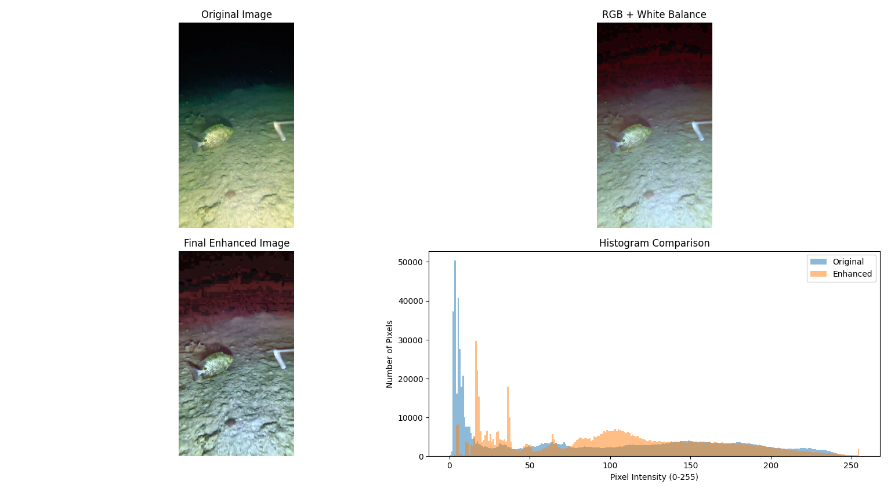
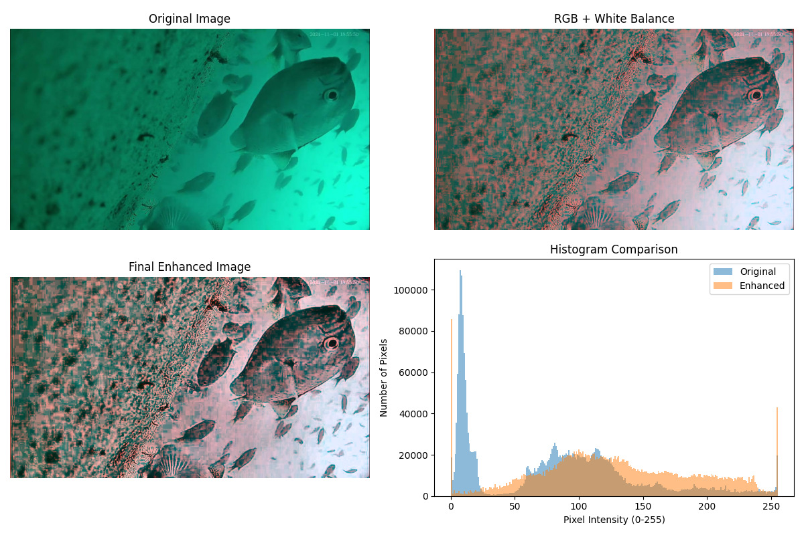
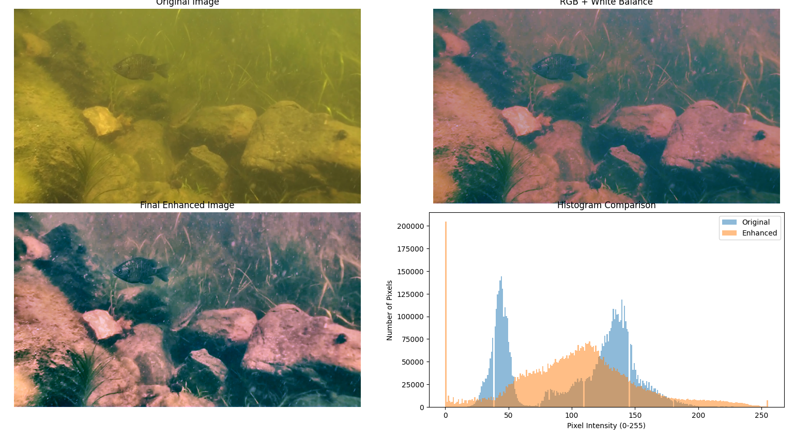

# 🌊 Underwater Image RGB Color Enhancement

A Python-based underwater image enhancement project that improves the visibility, contrast, and color quality of underwater images using image processing techniques.

---

## 📌 Project Overview

Underwater images often suffer from poor visibility, low contrast, and color distortion due to light absorption and scattering in water. This project enhances underwater images by applying image processing techniques such as Histogram Equalization, White Balancing, and Contrast Limited Adaptive Histogram Equalization (CLAHE) to produce visually improved results.

---

## 🎯 Objective

To improve the quality of underwater images by enhancing brightness, contrast, and color balance, making them more suitable for marine research, underwater exploration, and computer vision applications.

---

## ✨ Features

- Enhances underwater RGB images
- Histogram Equalization on the Red channel
- White Balance correction
- Contrast enhancement using CLAHE
- Histogram comparison before and after enhancement
- Simple menu-driven Python program

---

## 🛠️ Technologies Used

- Python
- OpenCV
- NumPy
- Matplotlib

---

## 📂 Project Structure

```
Underwater-Image-RGB_Color-Enhancement/
│
├── input_images/
│   ├── underwater img 1.jpg
│   ├── underwater img 2.jpg
│   └── underwater img 3.webp
│
├── results/
│   ├── comparison_image1.png
│   ├── comparison_image2.png
│   └── comparison_image3.png
│
├── underwater_image_enhancement.py
├── requirements.txt
└── README.md
```

---

## ⚙️ Enhancement Pipeline

The enhancement process follows these steps:

1. Histogram Equalization on the Red Channel
2. White Balance Correction
3. CLAHE (Contrast Limited Adaptive Histogram Equalization)
4. Histogram Comparison

---

## 🖼️ Results

### Comparison Result 1



### Comparison Result 2



### Comparison Result 3



---

## 👥 Team Project

This project was developed as a **six-member academic team project**.

---

## 👤 My Contribution

- Implemented the underwater image enhancement pipeline in Python.
- Applied Histogram Equalization, White Balance, and CLAHE techniques.
- Generated histogram comparisons for image analysis.
- Tested the enhancement process on multiple underwater images.
- Organized the GitHub repository and prepared the project documentation.

---

## 🚀 Future Enhancements

- Deep learning-based underwater image enhancement
- Real-time underwater video enhancement
- Graphical User Interface (GUI)
- Integration with underwater object detection models

---

## 📄 Requirements

Install the required Python libraries using:

```bash
pip install -r requirements.txt
```

---

## 📜 License

This project is intended for academic and educational purposes.
